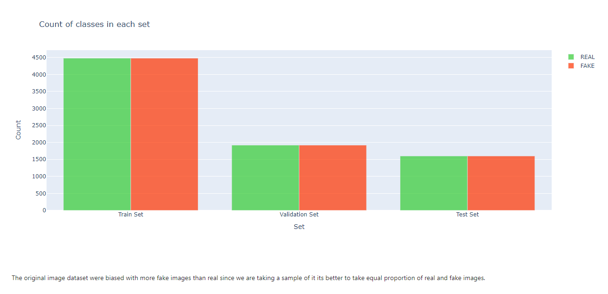
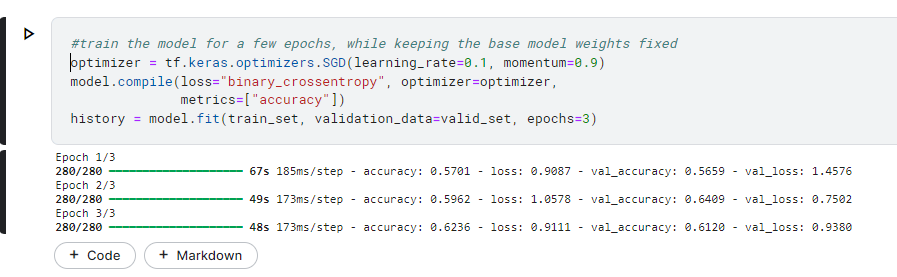
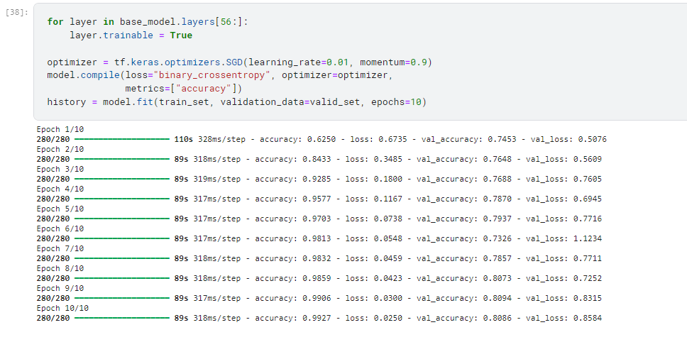
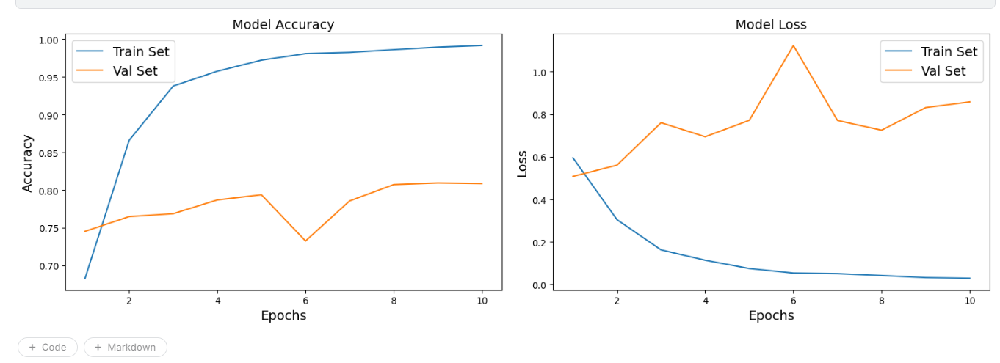
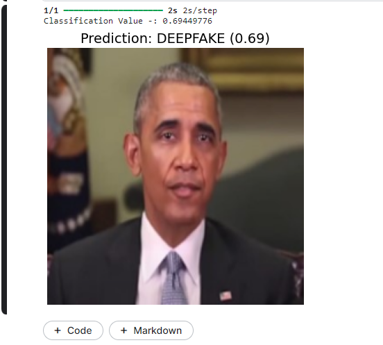
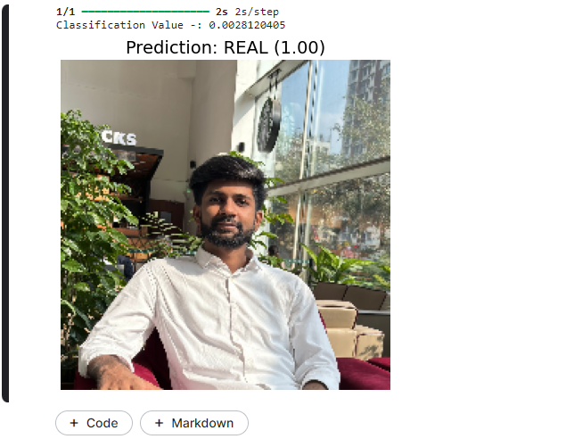
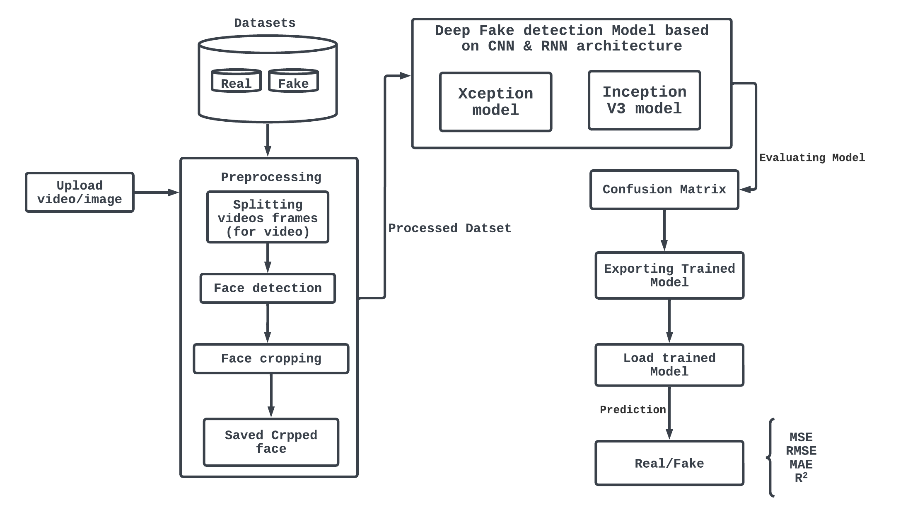

# Deep Fake Detection using Deep Neural Networks

## Team members

- Adil Khatri - adilaqzma@gmail.com
- Harsh Chotaliya - harshchotaliya269@gmail.com
- Shubham Kanojiya - shubhamskanojiya9@gmail.com

## Problem Statement

Detecting deep fake videos and images has become increasingly challenging with the proliferation of sophisticated manipulation techniques. This project aims to develop and implement a Deep Neural Network (DNN)-based solution to accurately identify and distinguish between authentic and manipulated visual content, addressing the growing concerns of misinformation and deceptive media in digital platforms.

## Description
### 1. Objective: 
- The primary objective of the project is to develop an effective deep fake detection system using Deep Neural Networks (DNNs) to combat the spread of misinformation and deceptive media content online.
### 2. Methodology:
- Utilizing state-of-the-art DNN architectures such as Convolutional Neural Networks (CNNs) and Recurrent Neural Networks (RNNs) for feature extraction and classification.
- Incorporating advanced techniques like transfer learning to leverage pretrained models such as Xception and InceptionV3 for efficient model training.
- Implementing data preprocessing techniques including image augmentation, frame extraction, and sequence preparation to enhance model robustness and performance.
### 3. Data Collection and Preparation:
- Gathering diverse datasets containing both authentic and manipulated visual content, including images and videos, to train and evaluate the models.
- Preprocessing the collected data to ensure consistency and quality, including data cleaning, normalization, and splitting into training, validation, and test sets.
### 4. Model Development and Training:
- Designing and implementing custom CNN and RNN architectures tailored to the specific requirements of deep fake detection.
- Fine-tuning pretrained models like Xception and InceptionV3 on the collected datasets to adapt them to the task of deep fake detection.
- Training the models using appropriate optimization algorithms, loss functions, and evaluation metrics to achieve optimal performance.

## Links

- GitHub Repo link: [Link to GitHub repository](https://github.com/adil-khatri/DeepFake-Detection-)

## Applications

- Deep fake detection models developed using DNNs have diverse applications, including media integrity assurance, forensic analysis, content moderation, cybersecurity, entertainment, and political integrity.
- These models play a crucial role in upholding trust, security, and accountability in various sectors by automatically detecting and flagging potentially manipulated images and videos, thereby preventing the spread of misinformation and ensuring the authenticity of digital media content.

## Future scope

- Source Identification: Implementing reverse engineering approaches to trace the origin of deep fake content back to its source, which could involve analyzing metadata, digital footprints, and patterns in the manipulation techniques used. 
- Development of Advanced Detection Techniques: Continuously researching and developing advanced detection techniques, such as adversarial learning and anomaly detection, to stay ahead of evolving deep fake generation methods and ensure robustness against emerging threats.
- Collaboration and Standardization: Collaborating with researchers, industry stakeholders, and policymakers to establish standardized protocols, datasets, and benchmarks for deep fake detection and source attribution, fostering transparency and interoperability across different detection systems.

## Screenshots

|  |  | 
| :------------------------------------------: | :----------------------------------------: | 
|              Dataset Distribution               |                  Dataset preview                  |

|  |  | 
| :------------------------------------------------: | :------------------------------------------: |
|                Freezing Base Layers and Training with 3 epoch                 |                 Unfreeze and Train all layers with 10 epochs                 | 

|  |  | 
| :----------------------------------------------: | :------------------------------------------: | 
|               Xception Model Accuracy                |                   Evaluation of Xception Model                   |              
|  |  | 
| :-------------------------------------------: | :------------------------------------------: | 
|             Obama DeepFake Prediction            |               Adil Real Prediction               |   

## Project Setup

- To run this project, TensorFlow version 2.1.6 is required. Users can utilize platforms such as Google Colab or Kaggle notebooks to access GPU resources for faster computation. 
- Additionally, the project includes a Models folder containing the implementations of three models: DenseNet, Xception, and InceptionV3, tailored specifically for detecting deepfake images and videos.
- These models serve as powerful tools for accurately identifying manipulated content and are readily available for integration into various applications and projects aimed at combating the proliferation of deepfake media.
- Also, you can utilize image models, videos are converted into frames, and bagging boosting techniques can be applied to enhance accuracy on random frame subsets and aggregating predictions, thereby improving deepfake video detection.

### For Machine Learning Models

### 1. Xception Image Detection:
#### - Since the Model can't be uploaded on github due to exceed in size limit. Feel free to contact me via email.
- Run the xception_image_detection.py file to predict whether an image contains a deepfake or not using the Xception pre-trained model.
- Ensure you have the necessary dependencies installed, including TensorFlow 2.16.1.
- Pass the image file as input to the script for prediction.
### 2. InceptionV3 Video Detection:
- Execute the inceptionv3_video_detection.py file to predict the presence of deepfake content in videos using the InceptionV3 pre-trained model.
- Provide the video file as input to the script to generate predictions.
### 3. DenseNet Image Detection:
- Utilize the densenet_image_detection.py file to determine whether an image is a deepfake or authentic using the DenseNet model.
- Make sure to have necessary dependencies installed.
- Input the image file to the script to obtain predictions.

### Note: Pre-trained model files (.h5) are available in the Models folder and can be used interchangeably with the provided scripts by passing images or videos as input.

- Inside the model generation, there are files for generating DenseNet models and models for image/video processing. 
- The .h5 models are provided in the Models folder, offering flexibility for usage by accepting images and videos as input for various applications.

## System Architecture

